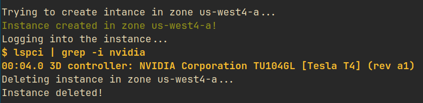
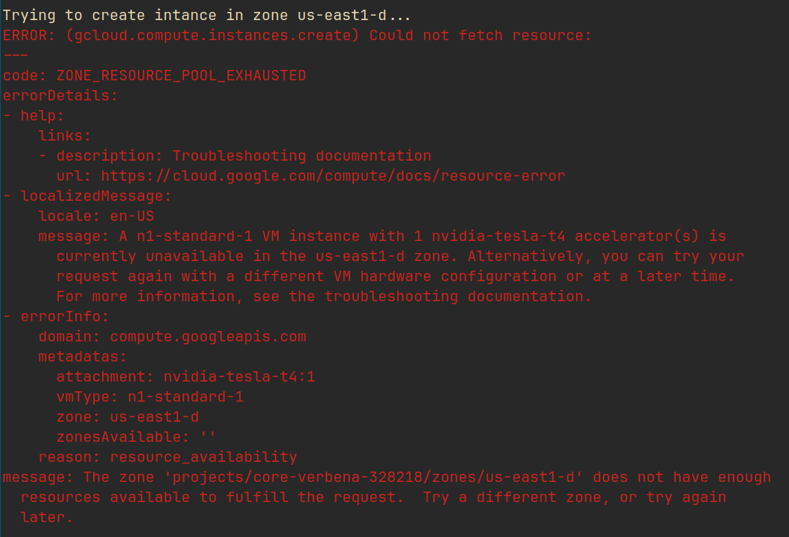
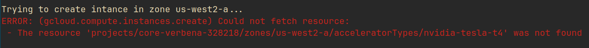
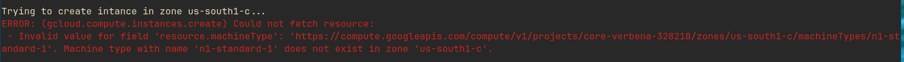

# Google Cloud GPU Search 
https://github.com/zyxdenny/google-cloud-gpu-search

## Goal
Iterate through all different zones on Google Cloud and search for available NVIDIA T4 GPU. 

## Prerequisite
Install [Google Cloud SDK](https://cloud.google.com/sdk/docs/install-sdk) and [initialise](https://cloud.google.com/sdk/gcloud/reference/init) it.

## Usage
```
./vm-manage.sh project_name service_account [/path/to/output/table]
```
`project_name` is the name of your project; `service_account` is the [Google Service Account](https://cloud.google.com/compute/docs/access/service-accounts). If you are not sure what your service account is, see the "Equivalent code" section for the default account when you manually generate an instance. `[/path/to/output/table]` is the CSV file you can specify that have three columns: "Zone", "GPU available", and "GPU allocated to VM". The default name is `zones.csv` if no argument is provided. This CSV file will be generated when the program is running.

## Note 
If you do not have Google Cloud SSH-key pairs, the program will automatically generate `google_compute_engine.pub` and `google_compute_engine` SSH-key pair for you with no passphrase.

## Result 
An example output CSV `zones.result.csv` is the result run on Mar 04, 2024.

The screenshot below is an example output when the instance is successfully initialised.
 
The screenshot below is an example output when the resource pool is out.

The screenshots below are example outputs when there is no GPU in the zone.

 

## Sort the result 
To sort the result, use the command 
```
{ head -n 1 zones.result.csv; cat zones.result.csv | tail -n +2 | sort -t ',' -r -k2; } > zones.result.sorted.csv
```

